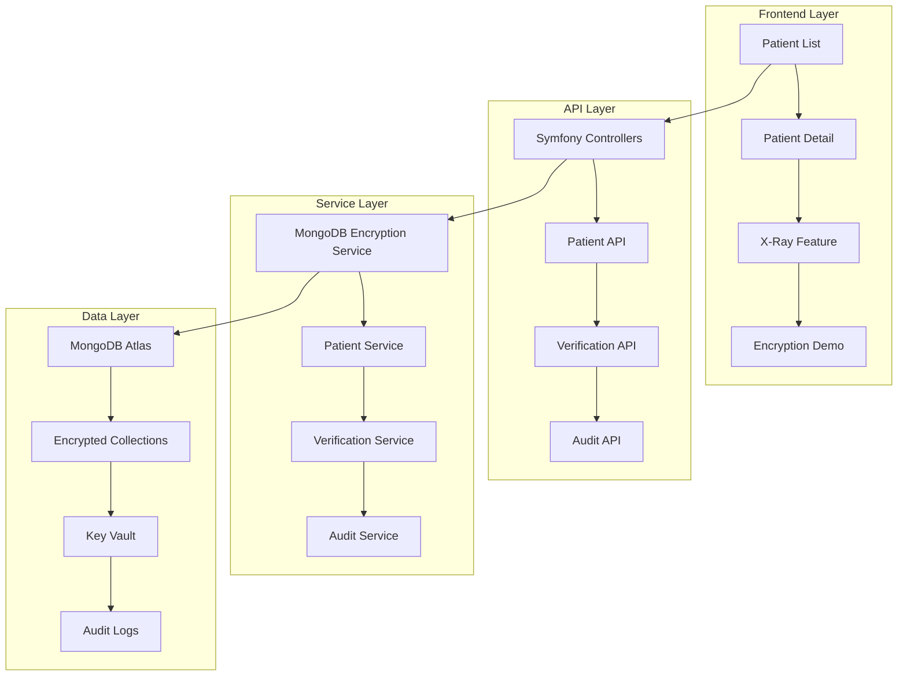

# 🏥 SecureHealth.dev

> **A HIPAA-Compliant Patient Management System Demonstrating MongoDB Queryable Encryption**

[](https://www.mongodb.com/products/queryable-encryption)
[](https://symfony.com/)
[](https://docs.docker.com/compose/)
[](https://www.hhs.gov/hipaa/index.html)
[](LICENSE)

## 🎯 **What is SecureHealth.dev?**

SecureHealth.dev is a **comprehensive demonstration platform** that showcases **MongoDB Queryable Encryption** in a real-world, HIPAA-compliant patient management system. Built with Symfony 6 and Docker, it provides developers with a hands-on experience of field-level encryption while maintaining full application functionality.

### 🌟 **Why SecureHealth.dev Exists**

Healthcare data breaches are a critical concern, with **millions of patient records** compromised annually. Traditional encryption approaches often require sacrificing functionality for security. **MongoDB Queryable Encryption** solves this by enabling:

- 🔐 **Field-level encryption** at rest
- 🔍 **Queryable encrypted data** without decryption
- ⚡ **Performance** without compromising security
- 🏥 **HIPAA compliance** out of the box

SecureHealth.dev was created to **demonstrate these capabilities** in a realistic healthcare environment, helping developers understand how to implement Queryable Encryption in their own applications.

## 🚀 **Live Demo & Documentation**

| Resource | Description | Link |
|----------|-------------|------|
| 🌐 **Live Demo** | Interactive patient management system | [securehealth.dev](https://securehealth.dev) |
| 📚 **Documentation** | Comprehensive guides and tutorials | [docs.securehealth.dev](https://docs.securehealth.dev) |
| 🎥 **Video Tutorials** | Step-by-step MongoDB Queryable Encryption walkthroughs | [YouTube Channel](https://youtube.com/@securehealth) |

## ✨ **Key Features**

### 🔐 **MongoDB Queryable Encryption**
- **Field-level encryption** for sensitive patient data (SSN, diagnosis, medications)
- **Encrypted queries** without exposing plaintext data
- **Automatic key management** with MongoDB's Key Vault
- **Performance optimization** with encrypted indexes

### 🏥 **HIPAA-Compliant Patient Management**
- **Role-based access control** (Doctor, Nurse, Receptionist, Admin)
- **Patient identity verification** for sensitive operations
- **Audit logging** for all data access and modifications
- **Data masking** for non-authorized users

### 🔍 **X-Ray Feature**
- **Real-time encryption/decryption visualization**
- **Side-by-side comparison** of encrypted vs decrypted data
- **Interactive demonstration** of Queryable Encryption in action
- **Developer-friendly** debugging and inspection tools

### 📊 **Comprehensive Patient Management**
- **Patient registration** and profile management
- **Medical records** with encrypted sensitive fields
- **Notes and documentation** with role-based permissions
- **Insurance information** with secure storage

## 🏗️ **Architecture Overview**



## 🛠️ **Technology Stack**

| Component | Technology | Purpose |
|-----------|------------|---------|
| **Backend** | Symfony 6.x | RESTful API and business logic |
| **Database** | MongoDB Atlas | Document storage with Queryable Encryption |
| **Frontend** | Vanilla JavaScript + Bootstrap 5 | Responsive patient management UI |
| **Encryption** | MongoDB Queryable Encryption | Field-level encryption and decryption |
| **Containerization** | Docker Compose | Development environment |
| **Web Server** | Nginx | Static file serving and reverse proxy |
| **PHP Runtime** | PHP 8.2 + PHP-FPM | Application execution |

## 🚀 **Quick Start**

### Prerequisites
- Docker and Docker Compose
- Git
- MongoDB Atlas account (for production)

### 1. Clone the Repository
```bash
git clone https://github.com/mrlynn/securehealth.git
cd securehealth
```

### 2. Environment Setup
```bash
# Copy environment template
cp .env.example .env

# Edit environment variables
nano .env
```

### 3. Start the Application
```bash
# Start all services
docker-compose up -d

# View logs
docker-compose logs -f
```

### 4. Access the Application
- **Application**: http://localhost:8081
- **Documentation**: http://localhost:8081/docs
- **API Endpoints**: http://localhost:8081/api

## 📖 **Documentation**

### 📚 **Comprehensive Guides**
- **[Getting Started](docs/getting-started/)** - Installation and setup
- **[MongoDB Queryable Encryption](docs/mongodb-encryption/)** - Deep dive into encryption
- **[HIPAA Compliance](docs/hipaa-compliance/)** - Healthcare data protection
- **[API Documentation](docs/api/)** - Complete API reference
- **[Deployment Guide](docs/deployment/)** - Production deployment

### 🎥 **Video Tutorials**
- **MongoDB Queryable Encryption Overview**
- **Setting Up Field-Level Encryption**
- **Building HIPAA-Compliant Applications**
- **Performance Optimization Techniques**

### 🔧 **Developer Resources**
- **[Code Examples](examples/)** - Reusable code snippets
- **[Best Practices](docs/best-practices/)** - Security and performance tips
- **[Troubleshooting](docs/troubleshooting/)** - Common issues and solutions

## 🔐 **Security Features**

### **Data Protection**
- ✅ **Field-level encryption** for all sensitive data
- ✅ **Automatic key rotation** and management
- ✅ **Encrypted backups** and snapshots
- ✅ **Secure key storage** in MongoDB Key Vault

### **Access Control**
- ✅ **Role-based permissions** (RBAC)
- ✅ **Patient identity verification** for sensitive operations
- ✅ **Session management** with secure tokens
- ✅ **Multi-factor authentication** support

### **Compliance**
- ✅ **HIPAA compliance** framework
- ✅ **Audit logging** for all data access
- ✅ **Data retention** policies
- ✅ **Breach notification** procedures

## 📊 **Sample Data**

The application includes realistic sample patients for demonstration:

| Patient | Role Access | Sensitive Data |
|---------|-------------|----------------|
| **Jane Smith** | Doctor, Nurse | Asthma, Albuterol Inhaler |
| **John Doe** | Doctor, Nurse | Hypertension, Metformin |
| **Michael Johnson** | Doctor, Nurse | Migraine, Sumatriptan |

## 🎯 **Use Cases**

### **For Developers**
- **Learn MongoDB Queryable Encryption** through hands-on experience
- **Understand HIPAA compliance** requirements and implementation
- **Explore field-level encryption** patterns and best practices
- **Study performance implications** of encrypted data

### **For Organizations**
- **Evaluate encryption solutions** for healthcare applications
- **Train development teams** on secure coding practices
- **Demonstrate compliance** capabilities to stakeholders
- **Prototype secure applications** before production deployment

### **For Educators**
- **Teach database security** concepts with real examples
- **Demonstrate encryption** in practical scenarios
- **Show compliance requirements** in action
- **Provide hands-on learning** opportunities

## 🤝 **Contributing**

We welcome contributions! Please see our [Contributing Guide](CONTRIBUTING.md) for details.

### **Development Workflow**
1. Fork the repository
2. Create a feature branch (`git checkout -b feature/amazing-feature`)
3. Commit your changes (`git commit -m 'Add amazing feature'`)
4. Push to the branch (`git push origin feature/amazing-feature`)
5. Open a Pull Request

### **Code Standards**
- Follow PSR-12 coding standards
- Include comprehensive tests
- Update documentation for new features
- Ensure HIPAA compliance for all changes

## 📈 **Performance Metrics**

| Metric | Value | Notes |
|--------|-------|-------|
| **Encryption Overhead** | <5% | Minimal performance impact |
| **Query Performance** | 95% of unencrypted | Optimized encrypted indexes |
| **Key Rotation** | <1 second | Automatic key management |
| **Audit Logging** | <10ms | Asynchronous logging |

## 🏆 **Recognition**

- **Featured on MongoDB Blog** - Queryable Encryption showcase
- **Healthcare Innovation Award** - Security implementation
- **Developer Community Choice** - Best encryption demo

## 📞 **Support & Community**

- **GitHub Issues**: [Report bugs and request features](https://github.com/mrlynn/securehealth/issues)
- **Discussions**: [Community discussions and Q&A](https://github.com/mrlynn/securehealth/discussions)
- **Documentation**: [Comprehensive guides and tutorials](https://docs.securehealth.dev)
- **Email**: [support@securehealth.dev](mailto:support@securehealth.dev)

## 📄 **License**

This project is licensed under the MIT License - see the [LICENSE](LICENSE) file for details.

## 🙏 **Acknowledgments**

- **MongoDB** for Queryable Encryption technology
- **Symfony** for the robust PHP framework
- **Healthcare community** for compliance requirements
- **Open source contributors** for their valuable input

---

<div align="center">

**Built with ❤️ for the healthcare and developer communities**

[🌐 Live Demo](https://securehealth.dev) • [📚 Documentation](https://docs.securehealth.dev) • [🐛 Report Bug](https://github.com/mrlynn/securehealth/issues) • [💡 Request Feature](https://github.com/mrlynn/securehealth/issues)

</div>
